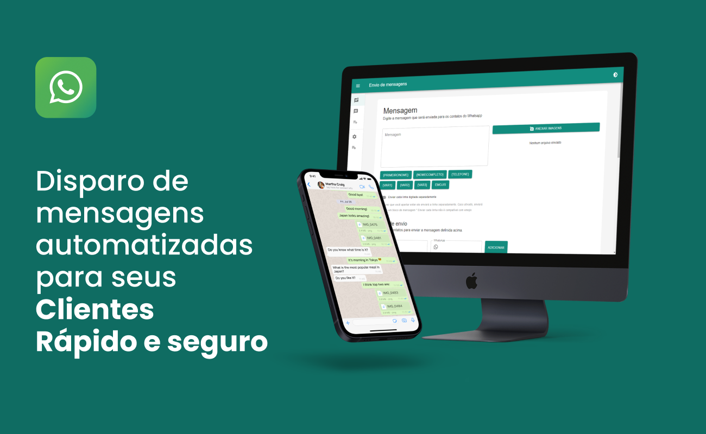

<a href="https://github.com/filipeleonelbatista/whatsapp-sender/blob/master/README.md" target="_blank">
  
  Version in Brasilian Portuguese
</a>
</br>
</br>



# Index

- [About](#-about)
- [Technologies](#technologies)
- [Installation](#installation)

## 🔖&nbsp; About

Application for sending bulk messages using Electron and React JS with Material UI to create the message and the sending lists, and it uses Selenium to perform the dispatches. It uses the Hygraph API to authenticate the tool.

[Website Link](https://enviodemensagensemmassa.vercel.app/)

## Objective

I created this app because my wife used to manage sales teams and needed to send messages to groups of saleswomen to keep everyone informed. So, I decided to develop it to expand my knowledge, and there was an opportunity to sell it to her colleagues. I had a total of 8 clients using this app. However, with the new updates from WhatsApp, it lost some functionality using Selenium, so I decided to discontinue this app.

I talk more about it [IN THIS POST](https://www.linkedin.com/posts/filipeleonelbatista_reactjs-typescript-selenium-activity-7034491662676434948--Pu-?utm_source=share&utm_medium=member_desktop) on my LinkedIn.

---

## Technologies

This project was developed with the following main technologies:

- [Selenium](https://www.selenium.dev/documentation/webdriver/)
- [Electron](https://www.electronjs.org/)
- [React JS](https://legacy.reactjs.org/docs/getting-started.html)
- [Hygraph](https://hygraph.com/)
- [Material UI](https://mui.com/material-ui/)

and more...

---

## Installation

The project runs with [Node.js](https://nodejs.org/) v20+.

Instructions to install the dependencies and start the project.

### Electron App

```sh
cd whatsapp-sender
npm i
npx run build
npx run start
```

### Landing

These commands will be executed in a terminal environment, assuming you have Node.js installed and the project's dependencies listed in the `package.json` file.

```sh
cd whatsapp-sender
npm i
npx run dev
```

## API da Hygraph

It's possible that the website is down or experiencing some issues, so it will be necessary to configure the Hygraph API in order to run the application.

Remember to create an instance in the Twitch development section and complete the authentication settings in the `api.ts` files located at `src/renderer/src/services/api.ts`, adding the `Base_URL` and `Authorization` of the application.

It's necessary to create the contents according to the `api.ts` file in Hygraph.


---

<h3 align="center">Let's connect 😉</h3>
<p align="center">
  <a href="https://www.linkedin.com/in/filipeleonelbatista/">
    
  </a>&ensp;
  <a href="mailto:filipe.x2016@gmail.com">
    
  </a>&ensp;
  <a href="https://instagram.com/filipeleonelbatista">
    
  </a>
</p>
<br />
<p align="center">
    Developed 💜 by Filipe Batista 
</p>

